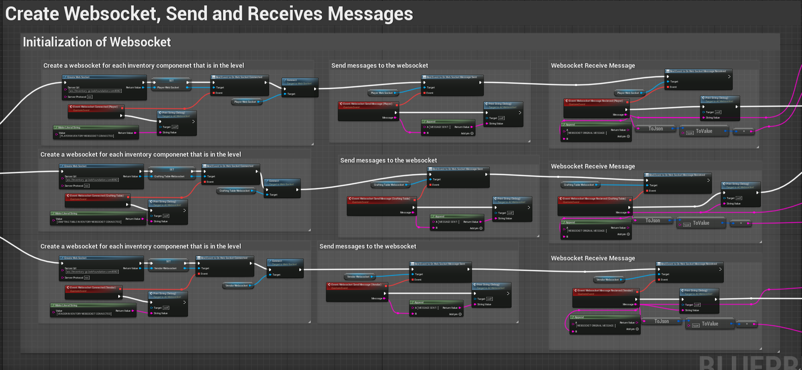
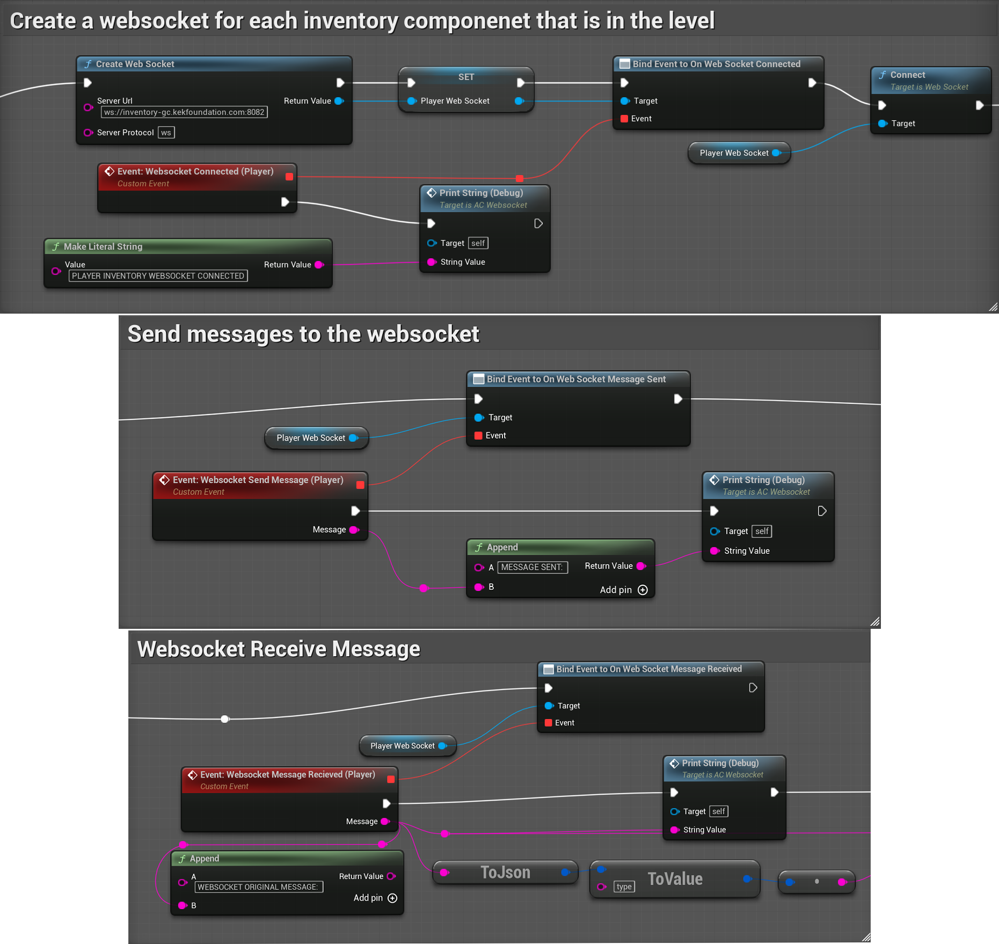
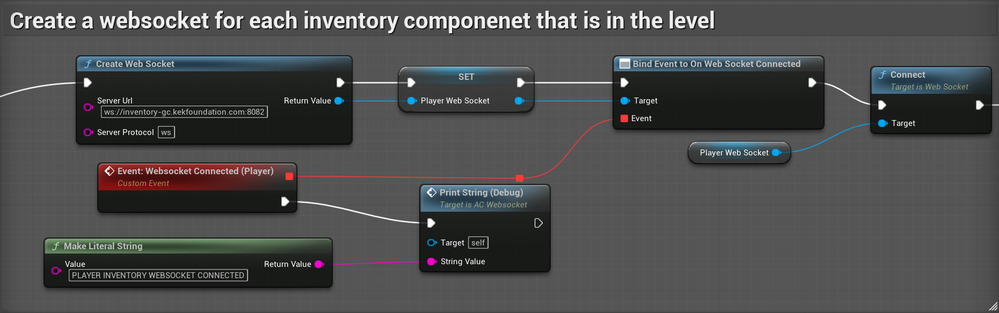
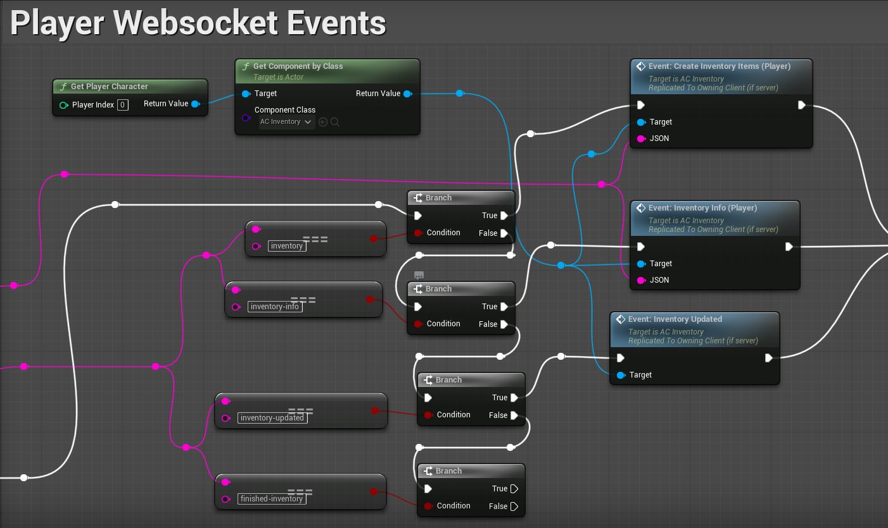
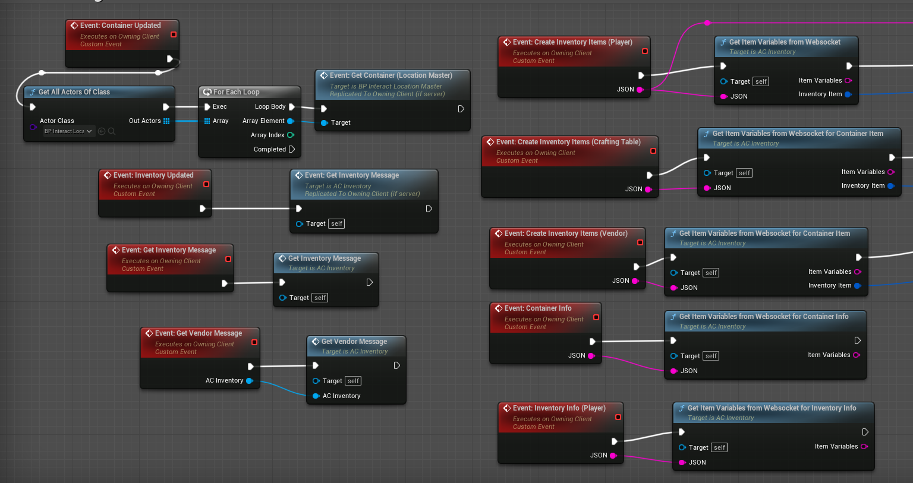
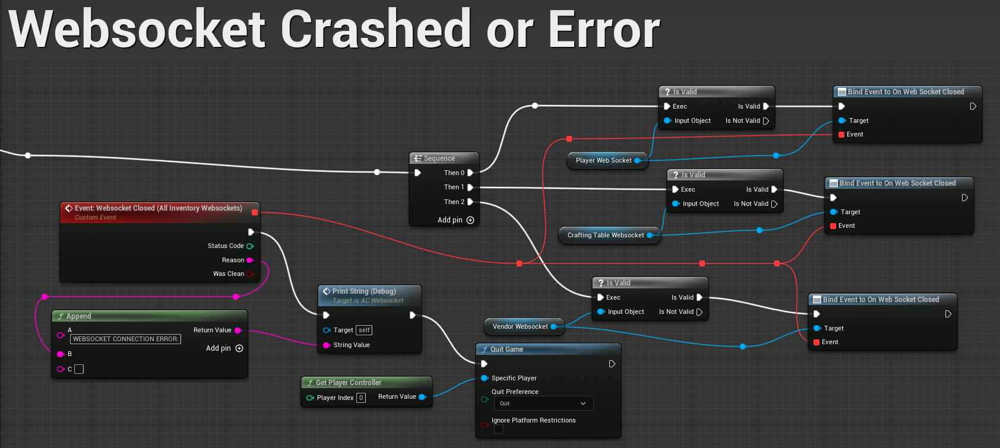
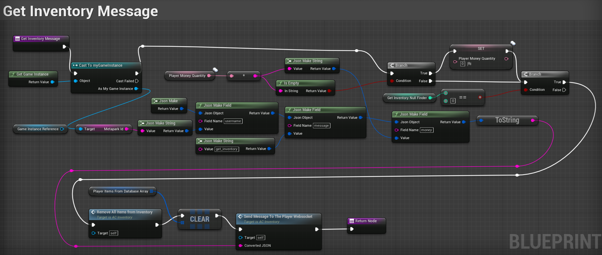
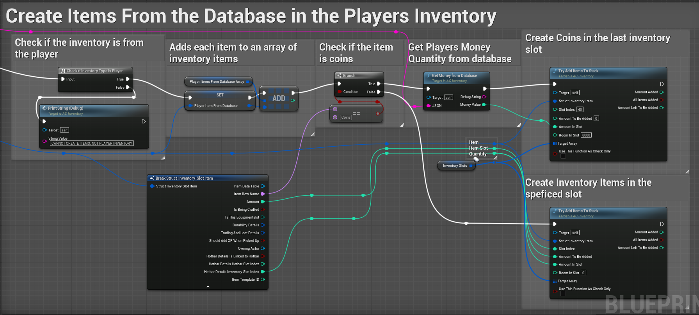

# Aftermath Islands Metaverse Inventory Save System

This document will go through the save system for an inventory system for the Aftermath Islands Metaverse project. The game is run through a pixel stream on Accelbytes servers, a pixel stream allows the game to be run through a web browser on PC and mobile phones. The game is being developed in Unreal Engine 5. 

The Blueprint/Visual coding was done by me, the Frontend Unreal Developer. The WebSocket Server and Backend Database were created by Aftermath Islands Backend Developer. The inventory system was prebuilt, and I had to rework it to have a save system that worked with a Backend Database. This project is ongoing so this document will be updated accordingly.

## Save System Overview:

I designed and created a save system that utilizes a WebSocket Server and a Backend Database to save player data. The WebSocket Server will send and receive messages when a certain action is done by the player in the game. For example, when a player moves an item in their inventory, a message containing the relevant item variables is sent to the WebSocket Server. The variables are then formatted into a JSON string which is the message, this message is then sent to the Backend Database. Once the Backend receives the message the JSON string is broken back down into individual variables and are stored in the Database. 

This approach was chosen because Aftermath Islands is an MMO game that will have a large amount of daily active users. By having a Backend system handling the inventory item actions this will allow future developers to make necessary updates to the game without the need for rebuilding. For example, if a player needs an item added to their inventory this can be done through the Backend without needing the item to be placed in the level. This approach also provides added security measures by reducing the risk of item duplication and cheating, as the database consistently maintains an accurate record of each player's inventory.

The inventory is unique for each Player, Vendor and Container through a Universally Unique Identifier (UUID). This allows the Backend to easily track the inventory contents for each inventory component in the level. The UUID is set for the player logs when they log into their account when starting the game. The UUID for Vendors and Containers is set in Unreal Engine. 

The WebSocket code is implemented as an Actor Component that can be easily attached to any Blueprint requiring a connection to the WebSocket Server. An Actor Component was chosen since it enables modular coding by the reuse of the same component across several blueprints. 

## Websocket's:

### Websocket Creation

The Clubhouse level in Aftermath Islands uses three connected WebSocket’s to use the inventory system (these include Vendors, Containers, and Players) Each of these WebSocket’s is connected to its own WebSocket Server on the same Port. These custom events are triggered upon the creation/spawning of the respective Actor.

### WebSocket Connection 

Upon creation, each WebSocket is immediately connected and can send and receive messages. 

### WebSocket Sent Messages 

Sent messages are triggered when a particular action is executed, such as when a player moves an item. The code is the same for each the Vendors, Containers, and Players.

### WebSocket Recieved Messages

Received messages are based on the JSON message received from the backend. For example, if the JSON string reads "inventory" the WebSocket creates the relevant items in the player's inventory. The code is the same for each the Vendors, Containers, and Players.

### WebSocket Message Events

The received messages are executed in the Inventory Component, each message is run through a custom event running on the owning client. 

### WebSocket Disconnection 

In the event that the WebSocket server crashes, all players will be disconnected from the game to prevent cheating. Additionally, the player will not be able to use their inventory until the WebSocket server is restored.

### See Full WebSocket Blueprint Here: 

https://blueprintue.com/blueprint/egestpq_/ 

## Inventory Componenet:

The inventory component is where code for the sent and received WebSocket messages are executed.  There is a separate message for each action that can be made by any of the Vendors, Containers, and Players. 

### Websocket Sent Message Code:

To ensure synchronization between the game and the database, whenever a player makes changes to their inventory, they receive a message (get inventory message) that removes and recreates all the items in their inventory. See how this process works for the Player below.

 When the items are created, they are added to an item array, this array contains all the player’s inventory items. See how items are created for the Player below. The code is the same for the Vendors and Containers.

 
 
 Each item will also have a unique identifier (Item ID) that will tell it apart from the other items any of the inventories. This process is the same for Containers and Vendors, each having their own respective arrays. 

### Websocket Sent Message Process:

WebSocket Messages are designed with a common base code to retrieve specific item variables related to the altered item. These item variables include quantity, slot ID, name, etc. The item variables are compared with the variables in the player item array mentioned above to find the correct Item ID for the item. Once the item ID is found, the item variables are converted into individual variables (integer, string, float, etc), which are then transformed into a JSON string containing the item information. This WebSocket message containing the item information is then sent to the backend.

### See WebSocket Sent Messages Blueprint Here: 

https://blueprintue.com/blueprint/3izdf7i5/

### See Items broken Down and Formatted to a JSON string here: 

https://blueprintue.com/blueprint/glq997qx/ 

Once the items are formatted into JSON they are sent to the WebSocket