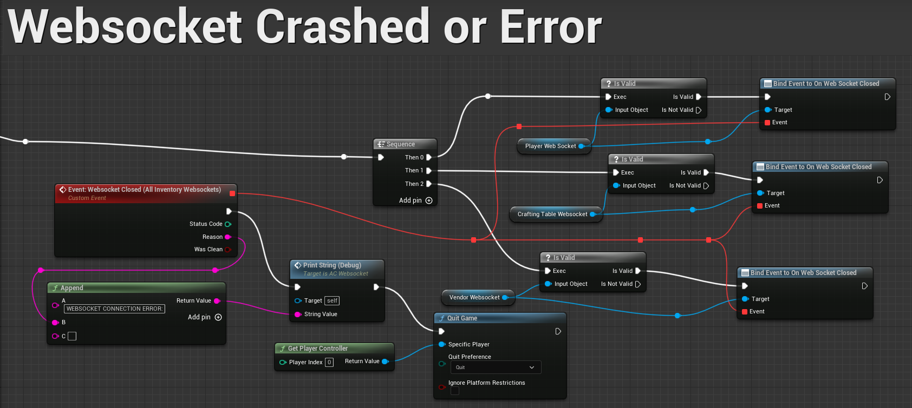
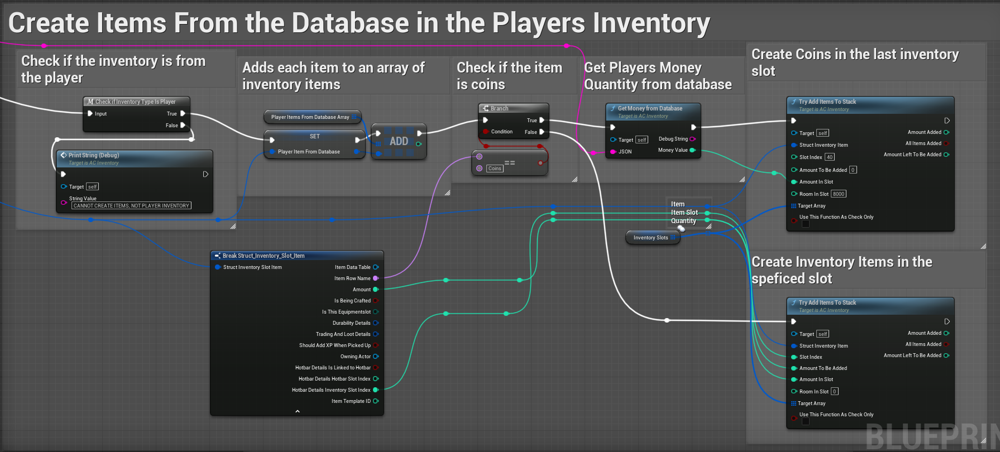

# Aftermath Islands Metaverse Inventory Save System

This document will go through the Save System for the inventory for the Aftermath Islands Metaverse project. Aftermath Islands is owned by Liquid Avatar Technologies and is an open-world multiplayer online game (MMO). Aftermath Islands is playable through a pixel stream which allows the game to be run through a web browser on PC and mobile phones and does not require any download from the player. The game is currently being developed in Unreal Engine 5. The first island (Clubhouse Island) was released to the public as an open beta in June 2023. This project is ongoing, so this document will be updated accordingly.

I was responsible for coding the Save System for the inventory through Blueprints. The WebSocket Server and Backend Database were developed by Aftermath Islands Backend Developer. The inventory system was premade, and I had to rework it to work with a Backend Database and Save System. 

## Save System Overview:

The Save System utilizes a WebSocket Server and a Backend Database to save player data. The WebSocket Server will send and receive messages when a certain action is done by the player in the game. For example, when a player moves an item in their inventory, a message containing the relevant item variables (slot ID, name, quantity, etc) is sent to the WebSocket Server. The variables are then formatted into a JSON string which is the message. This message is then sent to the Backend Database. Once the Backend receives the message, the JSON string is broken back down into individual variables and stored in the Database. The variables are stored based on the inventory components Universally Unique Identifier (UUID). 

The WebSocket code is implemented as an Actor Component that can be easily attached to any Blueprint requiring a connection to the WebSocket Server. An Actor Component was chosen since it enables modular coding by the reuse of the same component across several Blueprints. 

## Inventory Component Overview:

Each actor that needs an inventory will have an inventory Actor Component. The Clubhouse Island level has three Blueprints that have an inventory component (Vendors, Crafting Tables and each Player). The inventory for each Player, Vendor and Crafting Table is unique through a UUID. This allows the Backend to easily track the inventory contents for each inventory component in the level. The UUID is set for the player when they log into their Liquid Avatar account when starting the game. The UUID for Vendors and Crafting Tables is set in Unreal Engine. 
##

This approach was chosen because Aftermath Islands will be a large MMO game that will have a large amount of daily active users. Having a Backend Database handle the inventory item data and actions will allow future developers to make necessary updates to the game without the need for rebuilding. For example, if a player needs an item added to their inventory, this can be done through the Backend without needing the item to be placed in the level. This approach also provides added security measures by reducing the risk of item duplication and cheating, as the Database consistently maintains an accurate record of each inventory.

## Websocket's:

The Clubhouse level in Aftermath Islands has three Blueprints that have a WebSocket and an inventory component (these include Vendors, Crafting Tables, and each Player). Each of these WebSocket’s is connected to its own WebSocket Server on the same Port. 

### WebSocket Initialization

The custom events are triggered upon the code being executed in the respective Blueprint, which happens at begin play. The events will initialize the creation of each WebSocket for Vendors, Crafting Tables, and each Player.

### Websocket Creation and Connection

Upon creation, each WebSocket is immediately connected and can send and receive messages. 

### WebSocket Send Message 

Sent messages are triggered when a particular action is executed, such as when a player moves an item. The code is the same for each the Vendors, Crafting Tables, and Players.

### WebSocket Receive Message

Received messages are also triggered when a particular action is executed, such as when a opens their inventory. The received message will trigger a Received Message Custom Event depending on what JSON type is being sent by the WebSocket Server. The code is the same for each of the Vendors, Crafting Tables, and Players.

### WebSocket Received Message Events

Received messages are based on the JSON message received from the WebSocket Server. For example, if the JSON type string reads "inventory,” the WebSocket creates the relevant items in the player's inventory. The events for the Vendors, Crafting Tables, and Players will be different from one another because they have to execute different code for different WebSocket’s.

### WebSocket Server Crash or Disconnect

In the event that the WebSocket server crashes or disconnects, all players will be disconnected/kicked from the game. This is done to prevent any duplication of items or cheating while the server is offline. Additionally, the player will not be able to use their inventory until the WebSocket server is restored. 

### See Full WebSocket Blueprint Here: 

https://blueprintue.com/blueprint/egestpq_/ 

## Inventory Componenet:

The inventory component is where code for the sent and received WebSocket messages are executed.  There is a separate message for each action that can be made by any of the Vendors, Crafting Tables, and Players. 

WebSocket Messages are designed with a common base code to retrieve specific item variables related to the altered item. These item variables include quantity, slot ID, name, template ID, item ID, money, username (UUID), and durability. There are other variables, but those are the main ones used in every message. 

## WebSocket Send/Receive Message Code Examples

### WebSocket Get Inventory Message Code Example

To ensure synchronization between the game and the database, whenever a player makes changes to their inventory (move an item, open their inventory, etc.), they receive a message that removes and recreates all the items in their inventory. This message is the get inventory message. See an example of the get inventory message below.

### Create Inventory Items Code Example

 When the items are created, they are added to an array that contains all the player’s inventory items. Each item will have a UUID (Item ID) that will tell it apart from the other items in the inventories of any Player, Vendor, or Crafting Table in the level. This process is the same for Crafting Tables and Vendors, each one having its own respective arrays. See how this process works for the Player below.

### WebSocket Sent Messages Example 

This Blueprint Graph is inside of the inventory component and will show an example of some of the messages that are being sent to the backend for certain events to happen in-game. The messages follow a similar process for each of them, reusing many of the same functions. The process of the message is as follows: 

The process starts with breaking down the item into individual variables. These variables are then checked against the item array for the respective inventory component to get the Item ID. Once the Item ID is found, the message will be sent to the WebSocket Server.

See the Blueprint below:

https://blueprintue.com/blueprint/3izdf7i5/ 

 ### Get Item ID Code Example
 
The item variables are compared with the variables in the player item array mentioned above to find the correct Item ID for the item. Once the item ID is found, the item variables are converted into individual variables (integer, string, float, etc.), which are then transformed into a JSON string containing the item information. This WebSocket message containing the item information is then sent to the backend.

See the Blueprint below:

https://blueprintue.com/blueprint/a9shg80e/ 

### Inventory Item Variable Breakdown Example

This function is used in the sending of a WebSocket Message. As mentioned above, this is the function that will break down the item variables into individual variables. These variables are then formatted into JSON string. The message format needs to be in JSON because we are using a WebSocket. 

See the Blueprint below:

https://blueprintue.com/blueprint/glq997qx/